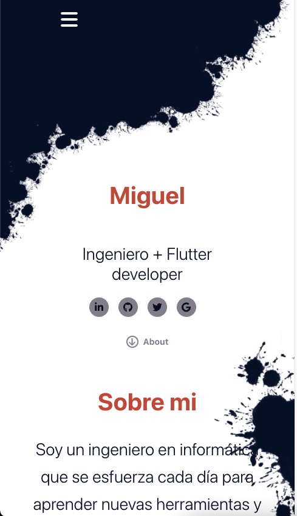
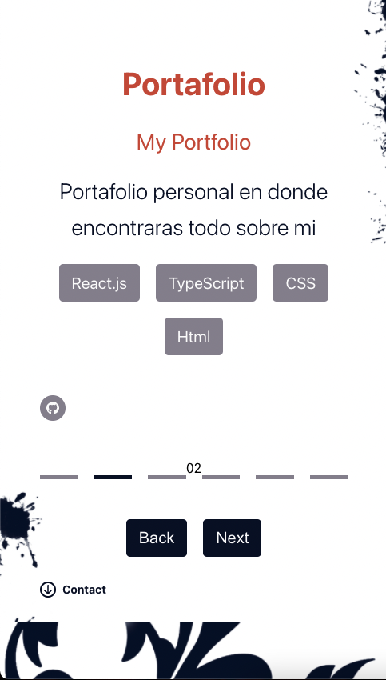
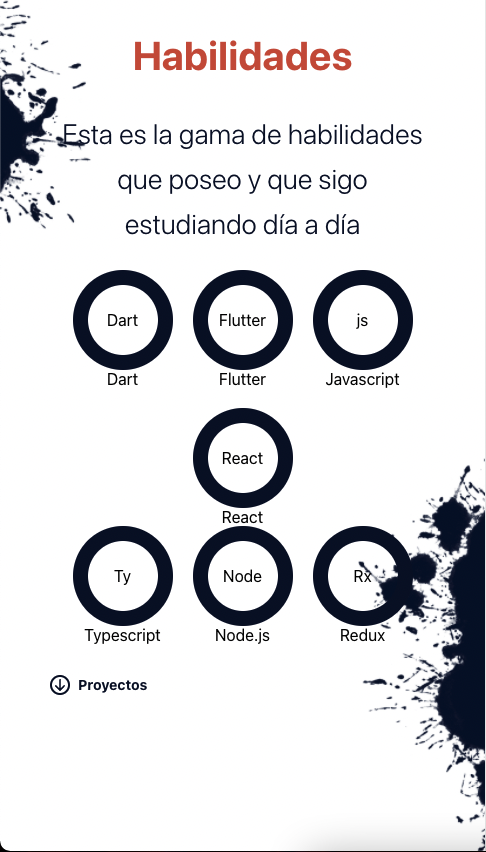
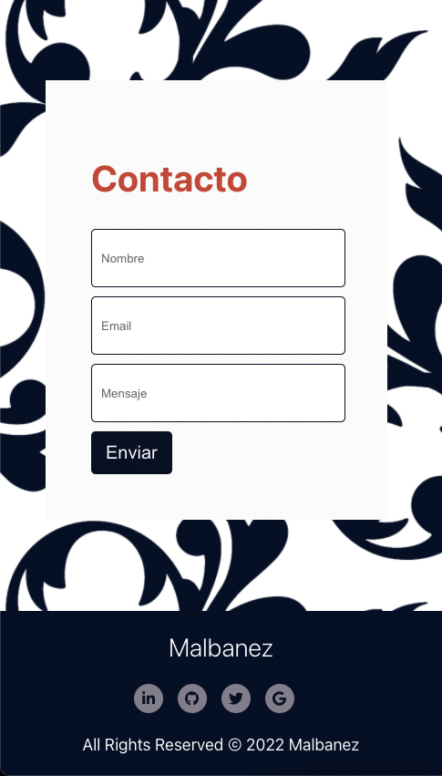
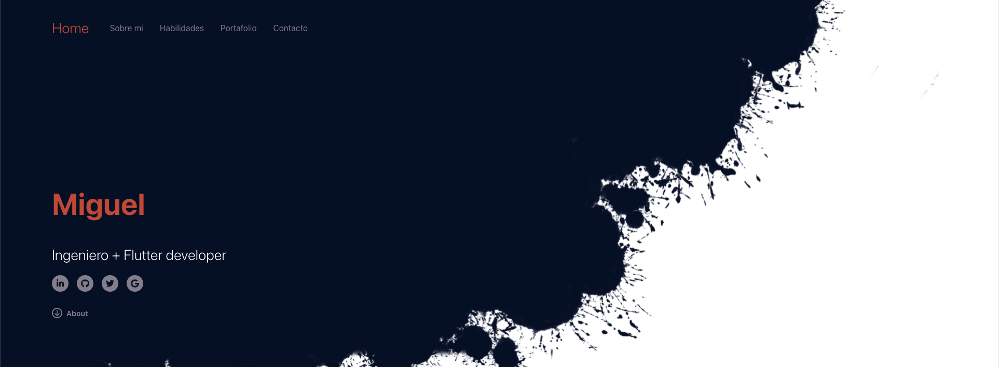
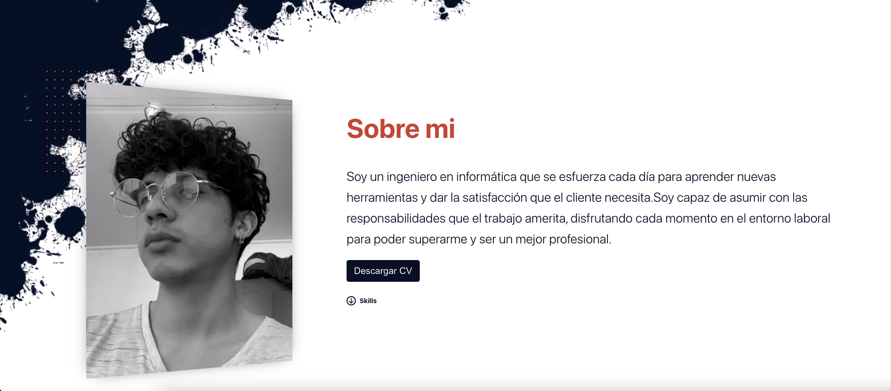
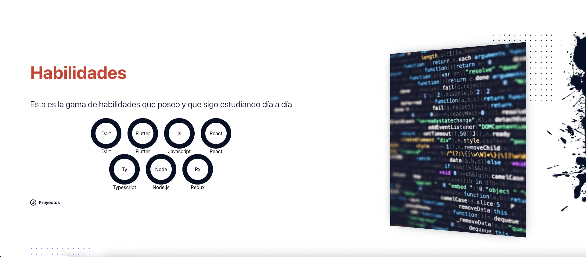
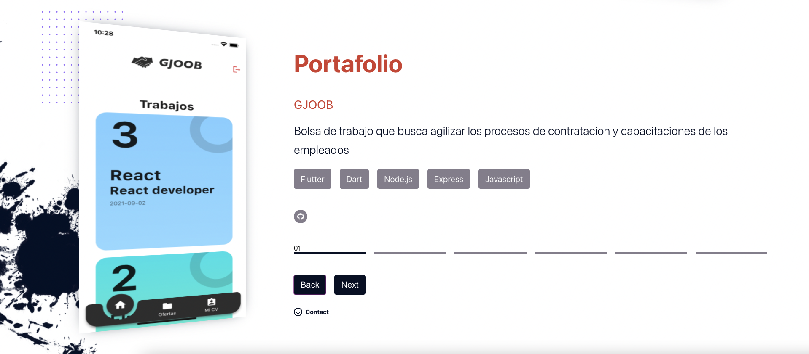
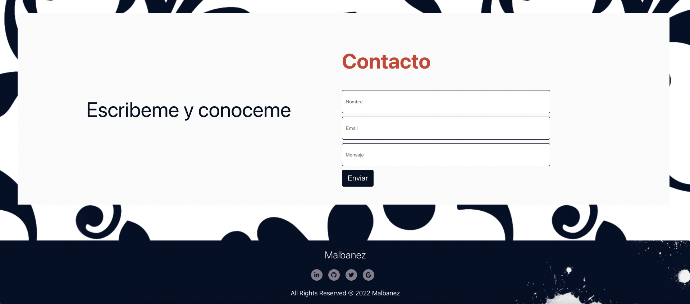

# MyPortfolio

Este es mi portafolio personal en donde encontraras todas las aplicaciones propias que he realizado, desde una bolsa de trabajo hasta un juego entrtetenido, te invito a conocerme.

## Instalación

Ejecutar el siguiente comando en la raiz del proyecto para instalar las dependencias
### `npm i`

## Levantar la aplicacion

### `npm start`

## Imagenes de la aplicacion movil y web

   
   
   
     

   
   
   
     
     

